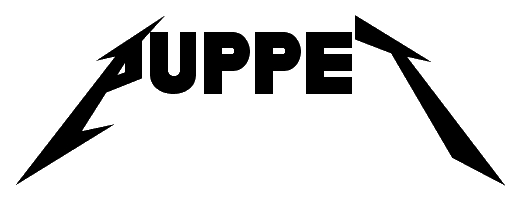

A .NET Core framework for home automation with Hubitat Elevate.

## How it works

1. An event on one of your devices is triggered. 
    Example: Your pantry door opens, triggering a contact sensor to send **open**.

2. The Puppet Executive process captures that event from Hubitat's websocket interface and raises it as a `System.Event` that can be handled in .NET Core code. 

3. The Puppet Executive passes event to the `AutomationFactory`. The `AutomationFactory` class instantiates the correct implementation of `IAutomation` based on various hints and returns it to the Executive.
    Example: The Executive asks `AutomationFactory` for IAutomation objects that are interested in this event (based on code attributes, like `TriggerDeviceAttribute`).

4. The Executive executes the `Handle()` method on each `IAutomation` object. The object can manipulate other devices via the `Hubitat` class, of which an instance can be passed in by the Executive. See the example later in this doc.

## Building

Either build the entire solution with Visual Studio or build the Puppet.Executive project at the command line by going to the project directory and running `dotnet build`.

## Setup the Maker API app

It's built-in to the Hubitat. Make sure you've turned it on and opted-in all your devices you want to access from Puppet.

## Running

Configure *appsettings.json*. At a shell prompt, switch to the Puppet.Executive folder and run `dotnet run`.

## Deployment to a Raspberry Pi

It'll run fine on Windows, which is where I test it. For production I use a Raspberry Pi running Raspbian for my instance.

1. Publish Puppet.Executive with the following:
    `dotnet publish -r linux-arm`
    
    This will build a self-contained deployment, including the SDK, so you won't need to install the SDK on the RPi.

2. Using your file copy tool of choice, copy the contents, which you'll find several levels deep in the *bin* directory, to a location on your RPi. I chose `/home/pi/executive`.

3. SSH to your Raspberry Pi. Give the executables permission to run. For example:
    ```
    chmod 755 /home/pi/executive/Puppet.Executive
    ```

4. Test the application by running it manually. Run the Executive with `./Puppet.Executive`. Press **Ctrl+C** to end it after you're satisfied it works.

5. Setup crontab on your Raspberry Pi to run the two apps in the background on startup. Run `crontab -e` and add the following line:
    ```
    @reboot cd /home/pi/executive && ./Puppet.Executive > /home/pi/executive.log
    ```

    This will run the app at startup and pipe its output to a log file in the home directory.

6. Reboot. `sudo reboot`

## Developing new automations

1. Add a class to `Puppet.Automation`. Name it whatever you want. I like ending with `Automation` as a convention, but do whatever you like.
2. Make it implement `Puppet.Common.Automation.IAutomation`.
3. Give it a constructor that takes a single `Puppet.Common.Services.HomeAutomationPlatform` if you want it to be able to do stuff to other devices on your Hubitat.
4. Decorate it with attributes to indicate what events the automation is interested in, like `TriggerDeviceAttribute`.
5. Run it. If your attributes are correct, that automation should get picked up and executed asynchronously.

### Example Automation

```csharp
namespace Puppet.Automation
{
    [TriggerDevice("Lock.FrontDoorDeadbolt", Capability.Lock)]
    public class NotifyOnDoorUnlock : AutomationBase
    {
        public NotifyOnDoorUnlock(HomeAutomationPlatform hub, HubEvent evt) : base (hub,evt)
        {
        }
        
        public override Task Handle(CancellationToken token)
        {
            if(_evt.value == "unlocked")
            {
                if(_evt.descriptionText.Contains("was unlocked by"))
                {
                    Speaker[] speakers = new Speaker[]{
                        _hub.GetDeviceByName<Speaker>("Speaker.KitchenSpeaker") as Speaker,
                        _hub.GetDeviceByName<Speaker>("Speaker.WebhookNotifier") as Speaker
                    };
                    speakers.Speak($"{_evt.descriptionText}.");
                }
            }

            return Task.CompletedTask;
        }
    }
}
```

## Enjoy!

I hope you like my work here. If you're having trouble, that's understandable - I wrote it for *me*, and sometimes that means that I don't think through usability stuff. Create an issue in this repo, or, better yet, send me a PR!

Lastly, please check out my social media presences!

* [Twitter](https://twitter.com/camsoper)
* [Twitch](https://twitch.tv/CamDoesCoolStuff) (I stream programming stuff)
* [My Twitch Archive on YouTube](https://www.youtube.com/playlist?list=PL7390OIw2znaTPK4GGCtRnoJe1scVl5ZT)

\- Cam
